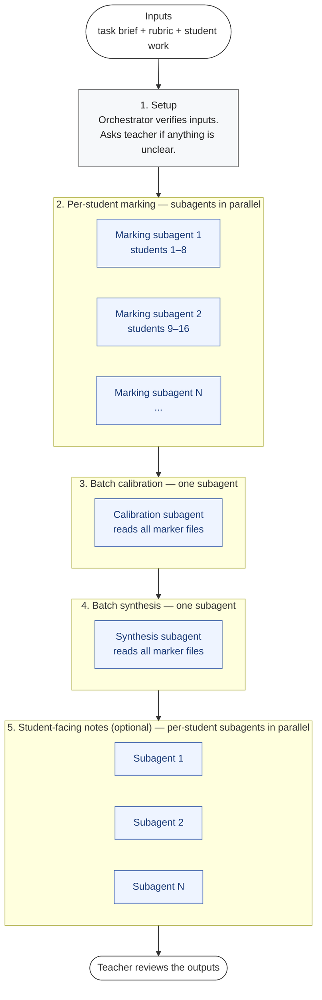

# Workflow

How the writing-marker agent moves from raw student work to teacher-ready feedback. The orchestrator coordinates; subagents do the reading. The five stages below run in order; only the last is optional.

## In prose

1. **Setup.** The teacher gives the orchestrator three things: a task brief, a rubric, and the student work. The orchestrator verifies it has all three and that they're internally consistent. If anything is missing or ambiguous, it stops and asks rather than guessing. The orchestrator does this directly — no subagents yet.

2. **Per-student marking.** The orchestrator partitions the batch and dispatches marking subagents in parallel — one for batches of ≤10, more for larger batches. Each subagent reads the rubric, the brief, and its assigned students' work in its own fresh context. For each student, it transcribes (if handwritten, using the `reading-handwritten-work` skill), checks required structural elements as PRESENT or ABSENT, scores against each criterion in the rubric, and writes a plain-text marker file. Each subagent returns only a one-line summary per student — the marker files live on disk. The orchestrator never reads them.

3. **Batch calibration.** The orchestrator dispatches one calibration subagent. The subagent reads the full set of marker files (the orchestrator does not), invokes the `calibrating-a-batch` skill to audit the batch for consistency — different bands for similar work, drift between early and late students, the same issue weighted differently — and saves the report to disk. It returns a one-paragraph verdict to the orchestrator. This stage is skipped for very small batches (under 6 students) where calibration would be statistically meaningless.

4. **Batch synthesis.** The orchestrator dispatches one synthesis subagent. The subagent reads the marker files, invokes `synthesizing-batch-issues` to pattern-mine across them, and produces a teaching-priorities document with counts, quoted examples, and a ranked punch-list of what to teach next. It saves the document to disk and returns the ranked punch-list to the orchestrator.

5. **Student-facing notes (optional).** Only runs if the teacher asks. The orchestrator dispatches one subagent per marker file, all in parallel. Each subagent invokes `writing-student-facing-feedback` to convert one teacher marker file into a short, constructive note the student can read directly — no peer comparisons, no rubric jargon, at a configurable language level (default B1).

## Why every reading stage is delegated

A marking decision made on a saturated context is a worse decision than one made on a fresh context. The orchestrator coordinates the workflow but never reads transcriptions, page images, or full marker files itself. Fresh subagent contexts make the marking, calibration, and synthesis each as good as they can be — and prevent drift between the first student marked and the last.

See `docs/subagent-architecture.md` for the partition sizing, what each subagent receives, and what it returns.

## What this diagram leaves out

- The five rules of **integrity** the marking subagents follow at every step (transcribe before judging, quote evidence verbatim, don't invent features, don't mistake authorial choice for error, apply the supplied rubric). These aren't a stage; they're the marker's character. See `CLAUDE.md`.
- The teacher-override mechanism for **default practices** like the grade ceiling, "credit what's present", and the calibration discipline. The teacher can adjust these at the start of any session. See `CLAUDE.md` for the integrity-vs-default distinction.
- The file locations. All real student data flows through `private/` (gitignored). All test fixtures live in `examples/`. See `docs/architecture.md` for paths.
