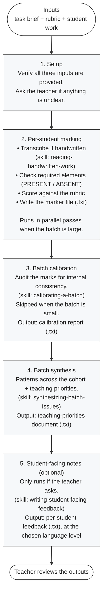

# Workflow

How the writing-marker agent moves from raw student work to teacher-ready feedback. The five stages below run in order; only the last is optional.

## In prose

1. **Setup.** The teacher gives the agent three things: a task brief, a rubric, and the student work. The agent verifies it has all three and that they're internally consistent. If anything is missing or ambiguous, it stops and asks rather than guessing.

2. **Per-student marking.** Each piece of student work goes through a small loop — transcribe if handwritten (using the `reading-handwritten-work` skill), check whether the required structural elements are PRESENT or ABSENT, score against each criterion in the rubric, and write a plain-text marker file. For large batches (above ~25 students), this stage fans out across parallel passes so the marking stays fresh from the first student to the last.

3. **Batch calibration.** Once all marker files are written, the agent invokes `calibrating-a-batch` to audit the batch for consistency — different bands for similar work, drift between early and late students, the same issue weighted differently. The report is shown to the teacher. This stage is skipped for very small batches (under 6 students) where calibration would be statistically meaningless.

4. **Batch synthesis.** The agent invokes `synthesizing-batch-issues` to pattern-mine across all marker files, producing a teaching-priorities document with counts, quoted examples, and a ranked punch-list of what to teach next.

5. **Student-facing notes (optional).** Only runs if the teacher asks. The agent invokes `writing-student-facing-feedback` to convert each teacher marker file into a short, constructive note the student can read directly — no peer comparisons, no rubric jargon, at a configurable language level.

## What this diagram leaves out

- The five rules of **integrity** the agent follows at every step (transcribe before judging, quote evidence verbatim, don't invent features, don't mistake authorial choice for error, apply the supplied rubric). These aren't a stage; they're the agent's character. See `CLAUDE.md`.
- The teacher-override mechanism for **default practices** like the grade ceiling, "credit what's present", and the calibration discipline. The teacher can adjust these at the start of any session. See `CLAUDE.md` for the integrity-vs-default distinction.
- The file locations. All real student data flows through `private/` (gitignored). All test fixtures live in `examples/`. See `docs/architecture.md` for paths.
